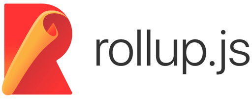

  
  

    <h1>Hi, I'm Jacob!</h1>
    
      The guy that gets hired as a <b>back-end developer</b> and <b>front-end developer</b>, but I seriously don't know what I'm doing.
    
  

  <h2>No seriously, what do I do?</h2>
  
    In all seriousness, I am a full stack developer. I used to work mostly on back-end stuffs, but now I am having more fun tinkering front-end stuffs.
  

  <h2>What do I use?</h2>
  

    Listed are wide variety of tools, technologies, programming or scripting languages, packages, engines or tools that I use in everyday's work.
    

      
      
      
      
      
      
      
      
      
      
      
      
      
      
      
      
      
    

  

  <h2>Interested in hiring me?</h2>
  

    You can reach me via email at
    <a href="mailto:hireme@thefurious.dev">
      hireme@thefurious.dev
    </a>
  

  <h2>What about my github stat?</h2>
  

    
  

